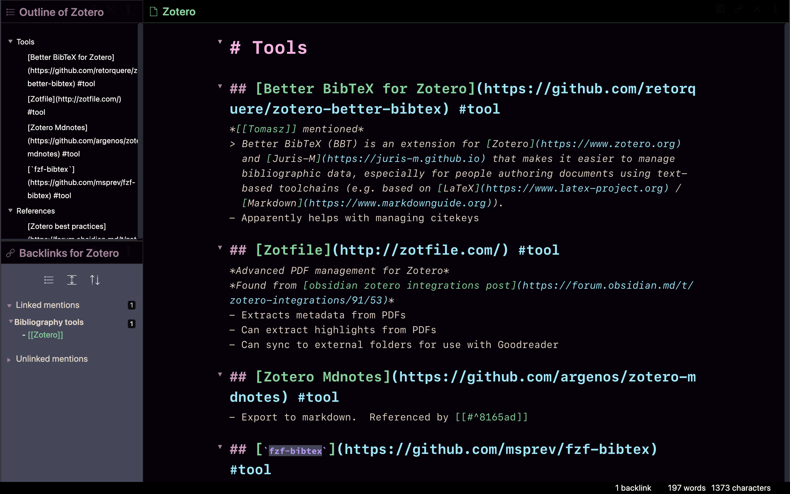

Obsidian theme
==============
An obsidian theme

Installation
============
1.  Turn on the 'Custom CSS' plugin in Obsidian: `Settings > Plugins > Custom CSS.`
2.  Download and copy [`obsidian.css`](./obsidian.css) to the root folder of
    your Obsidian vault. It should take effect immediately.

Credits
=======
Based on [Dracula theme](https://draculatheme.com/obsidian)

Bulk of design work done during session with [Matthew Tierney](https://matttierney.com/)
